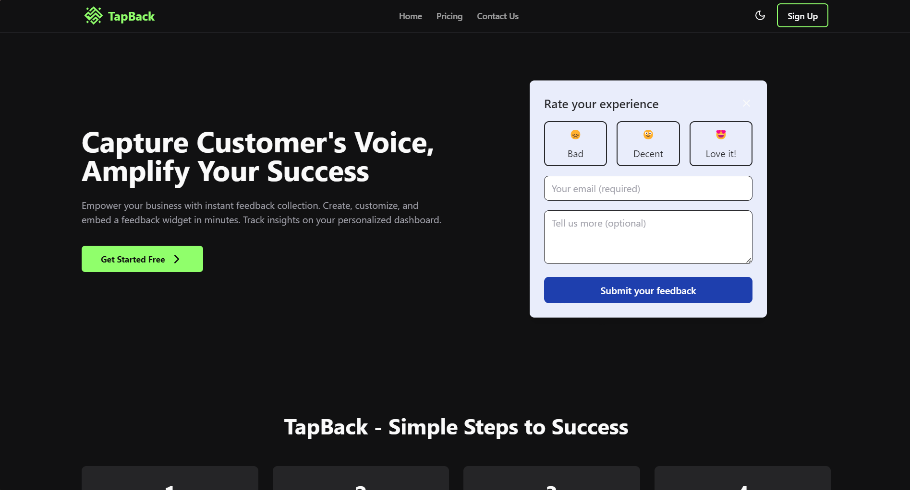
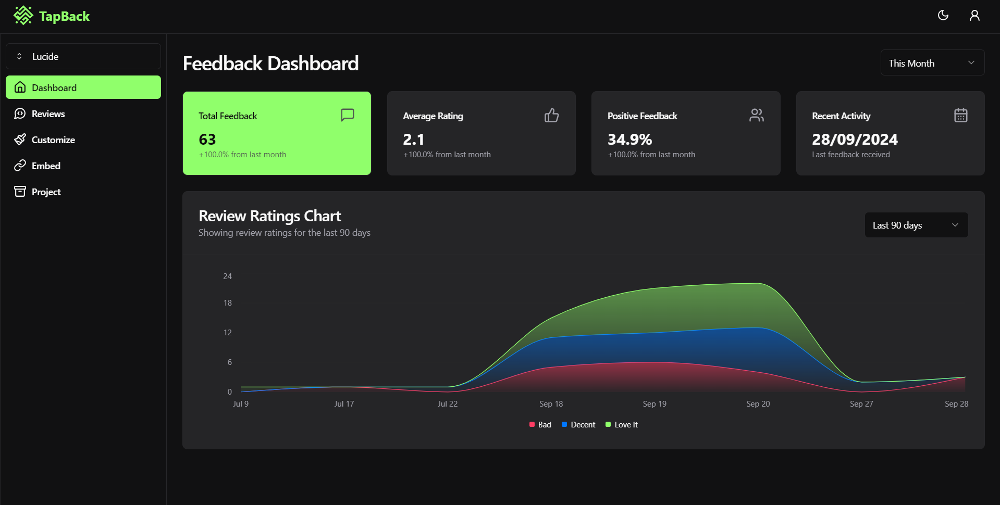
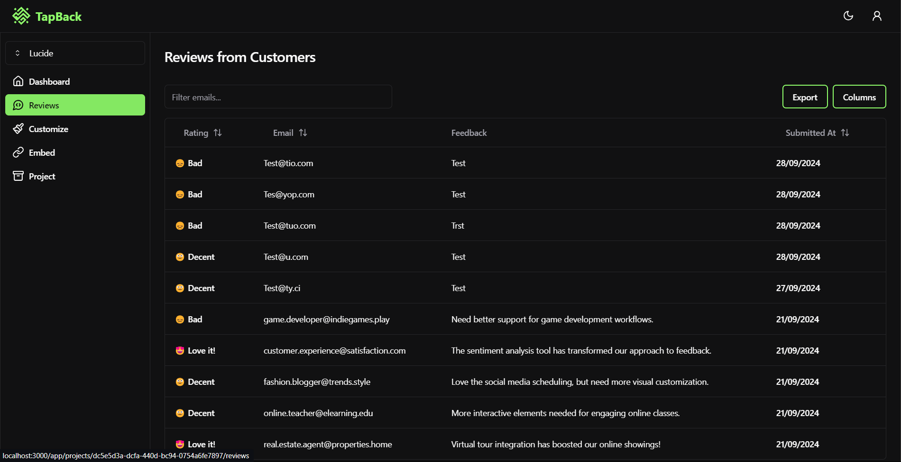
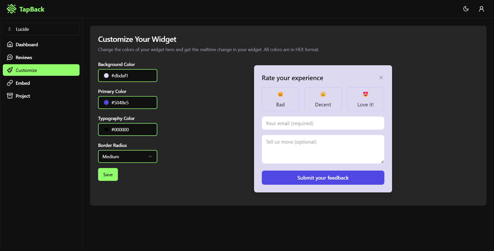
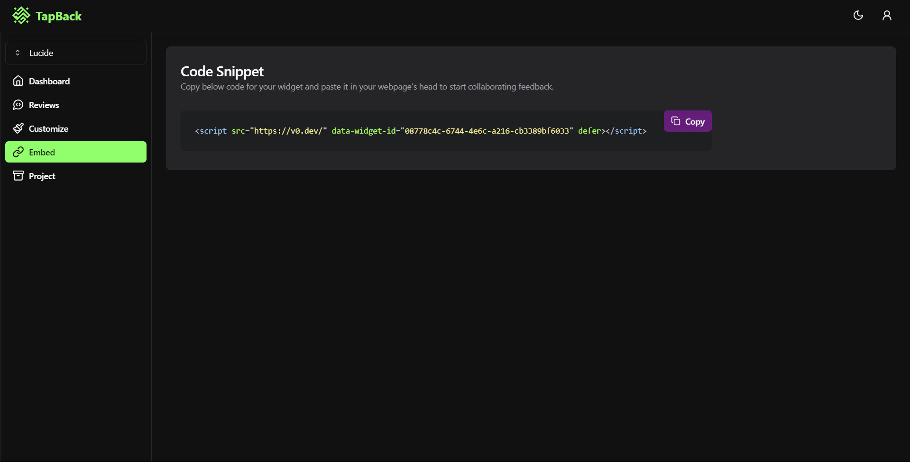

# TapBack

**TapBack** is a feedback widget SaaS platform that allows users to add customizable feedback widgets to their websites. It offers a comprehensive dashboard for managing feedback submissions, reviewing analytics, and customizing the widget's look and feel.



## Features

- **Multiple Projects**: Users can create and manage multiple projects, each with its own feedback widget.
- **Customizable Widget**: Full customization of widget colors, typography, and other styles.
- **Real-time Feedback**: Collect feedback from your website visitors and manage it through the dashboard.
- **Analytics Dashboard**: View and analyze the feedback provided by users across different projects.
- **Embed Widget Easily**: Simple script integration to add feedback widgets to any website.
- **Scalable Plans**: Pricing plans to accommodate different levels of user activity, from small startups to large enterprises.

## Screenshots









## Tech Stack

- **Frontend**: React, Next.js 14, TypeScript, Tailwind CSS
- **Backend**: Next.js API Routes, Prisma ORM, PostgreSQL
- **Authentication**: Lucia auth
- **Deployment**: Vercel
- **Styling**: Shadcn, Tailwind CSS, Framer Motion (for UI animations)

## Installation

### Prerequisites

- Node.js (v20^)
- PostgreSQL
- pnpm (or npm/yarn)

### Clone the repository

```bash
git clone https://github.com/J3E1/tapback.git
cd tapback
```

## Dashboard Features

#### Once logged in, users can:

* **Create Projects**: Add new projects to manage feedback for different websites.
* **Customize Widget**: Tailor the widget to your brand's color scheme.
* **View Feedback**: Access and manage feedback provided by users in real-time.
* **Get Embed Code**: Easily copy and paste the widget script into your website's HTML.

## Note from the Author

This is a side project and not a commercial offering. I built TapBack to experiment with Next.js, Prisma, and other technologies. It is free to use, but I do not guarantee any support or maintenance. Please keep in mind that it may contain bugs and might not include all features that you would expect from a commercial product. If you find it useful, please star the repository.
